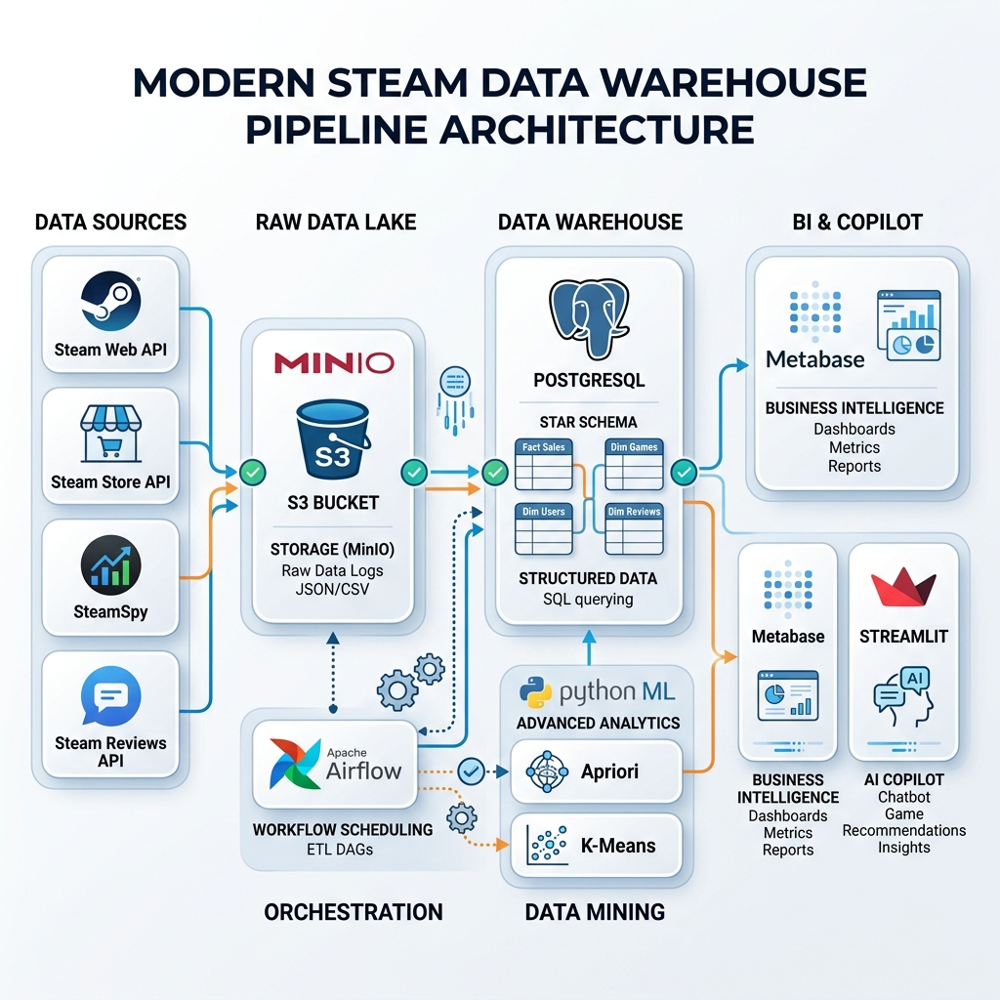

# 🎮 Steam Gaming Market Data Warehouse & Analytics Platform

[](https://www.docker.com/)
[](https://www.postgresql.org/)
[](https://airflow.apache.org/)
[](https://min.io/)
[](https://www.metabase.com/)
[](https://streamlit.io/)

Hệ thống Kho dữ liệu (Data Warehouse) và Khai phá dữ liệu (Data Mining) tự động theo dõi, phân tích thị trường game trên nền tảng Steam theo thời gian thực.

---

## 🏗️ Kiến trúc Hệ thống & Data Flow (Data Architecture)



### 🔄 Interactive Flow Diagram (Mermaid)

```mermaid
flowchart LR
    subgraph SOURCES ["🌐 1. Data Sources"]
        direction TB
        S1["<img src='https://cdn.simpleicons.org/steam/171A21' width='20'/> <b>Steam Web API</b><br/><i>(CCU Hourly)</i>"]
        S2["<img src='https://cdn.simpleicons.org/steam/171A21' width='20'/> <b>Steam Store API</b><br/><i>(Metadata Weekly)</i>"]
        S3["<img src='https://cdn.simpleicons.org/steam/171A21' width='20'/> <b>SteamSpy API</b><br/><i>(Tags & Owners)</i>"]
        S4["<img src='https://cdn.simpleicons.org/steam/171A21' width='20'/> <b>Steam Reviews API</b><br/><i>(Daily Reviews)</i>"]
    end

    subgraph LAKE ["🪣 2. Data Lake"]
        MINIO["<img src='https://cdn.simpleicons.org/minio/C72C48' width='22'/> <b>MinIO S3</b><br/><code>raw-steam-data</code>"]
    end

    subgraph ORCHESTRATION ["⚙️ 3. Orchestrator"]
        AIRFLOW["<img src='https://cdn.simpleicons.org/apacheairflow/017CEE' width='22'/> <b>Apache Airflow</b><br/><i>DAGs Scheduler</i>"]
    end

    subgraph DWH ["🗄️ 4. Data Warehouse"]
        STAGING["<b>raw Schema</b><br/><i>JSONB Staging</i>"]
        STARSCHEMA["<img src='https://cdn.simpleicons.org/postgresql/4169E1' width='22'/> <b>PostgreSQL 16</b><br/><i>Star Schema DWH</i>"]
    end

    subgraph MINING ["🤖 5. Data Mining"]
        direction TB
        APRIORI["<img src='https://cdn.simpleicons.org/python/3776AB' width='18'/> <b>Apriori / FP-Growth</b><br/><i>Tag Association Rules</i>"]
        KMEANS["<img src='https://cdn.simpleicons.org/scikitlearn/F7931E' width='18'/> <b>K-Means Clustering</b><br/><i>Market Segmentation</i>"]
        CART["<img src='https://cdn.simpleicons.org/scikitlearn/F7931E' width='18'/> <b>Decision Tree CART</b><br/><i>Hit Game Predictor</i>"]
    end

    subgraph BI ["📊 6. Serving & BI Layer"]
        direction TB
        METABASE["<img src='https://cdn.simpleicons.org/metabase/509EE3' width='20'/> <b>Metabase BI</b><br/><i>Drag & Drop Dashboard</i>"]
        STREAMLIT["<img src='https://cdn.simpleicons.org/streamlit/FF4B4B' width='20'/> <b>Streamlit Copilot</b><br/><i>Text-to-SQL AI Assistant</i>"]
    end

    SOURCES -->|Raw JSON| MINIO
    AIRFLOW -.->|Schedule & Audit| SOURCES & MINIO & DWH
    MINIO -->|Load JSONB| STAGING
    STAGING -->|SQL Transformation| STARSCHEMA
    STARSCHEMA -->|Data Mart Views| MINING
    STARSCHEMA --> METABASE & STREAMLIT
    MINING --> STREAMLIT
```



---

## 🛠️ Tech Stack

| Tầng chức năng | Công nghệ | Biểu tượng | Mô tả & Cổng kết nối |
|---|---|---|---|
| **Raw Data Lake** | **MinIO S3** |  | Lưu trữ dữ liệu thô JSONB (`9000` / `9001`) |
| **Data Warehouse** | **PostgreSQL 16** |  | Kho dữ liệu hình sao Star Schema (`5432`) |
| **Orchestrator** | **Apache Airflow** |  | Lập lịch & giám sát Data Pipeline (`8080`) |
| **Transform Engine** | **SQL / SQLMesh** |  | Biến đổi dữ liệu thô ➔ Dimensions & Facts |
| **Data Mining** | **Python ML** |  | Apriori, K-Means, CART Tree, BERTopic |
| **BI Dashboard** | **Metabase** |  | Trực quan hóa & Phân tích OLAP (`3000`) |
| **AI Copilot** | **Streamlit** |  | Trợ lý truy vấn SQL tự nhiên (`8501`) |

---

## 📂 Kiến trúc Thư mục (Directory Layout)

```text
.
├── docs/               # Hình ảnh kiến trúc & sơ đồ hệ thống
├── discuss/            # Tài liệu thiết kế & quy hoạch kiến trúc
├── scripts/            # Script khởi tạo Database SQL
├── ingestion/          # Thư mục chứa module gọi API Steam (curl_cffi)
├── dags/               # Apache Airflow DAGs
├── sqlmesh/            # Tầng SQL Transformation
├── mining/             # Các thuật toán Data Mining (Apriori, K-Means, CART)
├── dashboard/          # Source code ứng dụng Streamlit AI Copilot
├── docker-compose.yml  # File khởi chạy toàn bộ hệ thống
├── .gitignore          # Cấu hình bỏ qua file nhạy cảm & data rác
└── README.md           # Tài liệu hướng dẫn dự án
```

---

## ⚡ Khởi chạy nhanh (Quick Start)

### Yêu cầu tiên quyết
* [Docker Desktop](https://www.docker.com/products/docker-desktop/) & Docker Compose
* Git

### Khởi chạy 1 lệnh duy nhất
```bash
# Clone repository
git clone https://github.com/HakoNguyen/steam-mining.git
cd steam-mining

# Khởi chạy toàn bộ 5 dịch vụ
docker-compose up -d --build
```

### Các cổng truy cập Dashboard:
* 🪣 **MinIO Console:** `http://localhost:9001` (`admin` / `miniopassword123`)
* ⚙️ **Apache Airflow:** `http://localhost:8080` (`admin` / `admin`)
* 📊 **Metabase BI:** `http://localhost:3000`
* 🤖 **Streamlit Copilot:** `http://localhost:8501`
